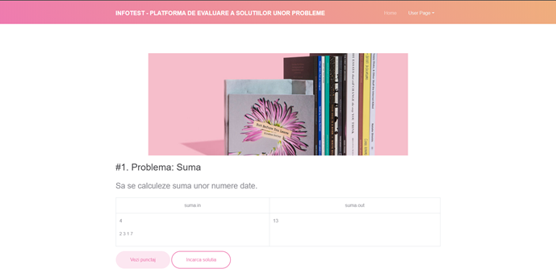

# InfoTest - Testing platform for algorithmic problems

## This project was made in collaboration with <i>Carstocea Cosmin</i>, <i>Marina Radu Fabian</i> and <i>Turcu Madalin</i> as an internship project at <i>University Petroleum-Gas of Ploiesti</i>
 

It proposed to create an web platform on which students to upload their solutions at problems of Data Structures and Algorithms.

As technologies, it uses: 
* Python for evaluating and compiling the solutions
* GCC as the compiler for C/C++ code
* Subprocesses to run the compilation routine
* Apache, MySQL, PHP and Laravel for backend of the server
* Using Laravel, it must build based on OOP and MVC principles
* Fronted was made using HTML, CSS and static React (Gatsby) to generate the webpages
* For CI pipeline and DevOps maintaining we used Docker containers

To make it extensible, we implemented a plugin/theme extension for Laravel, but it can use RESTful APIs if it is a must. To hook a plugin/theme, the app folder hosts all the plugins/theme files and it must be registered as class in plugins.php. Theme files are saved on the database and they are requested on home root when necessary.
